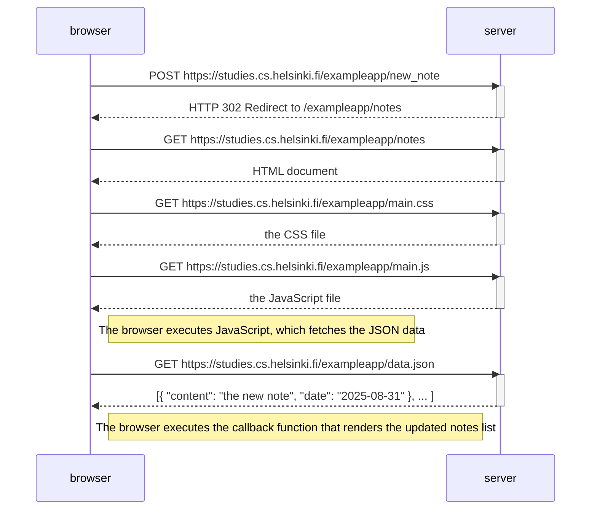
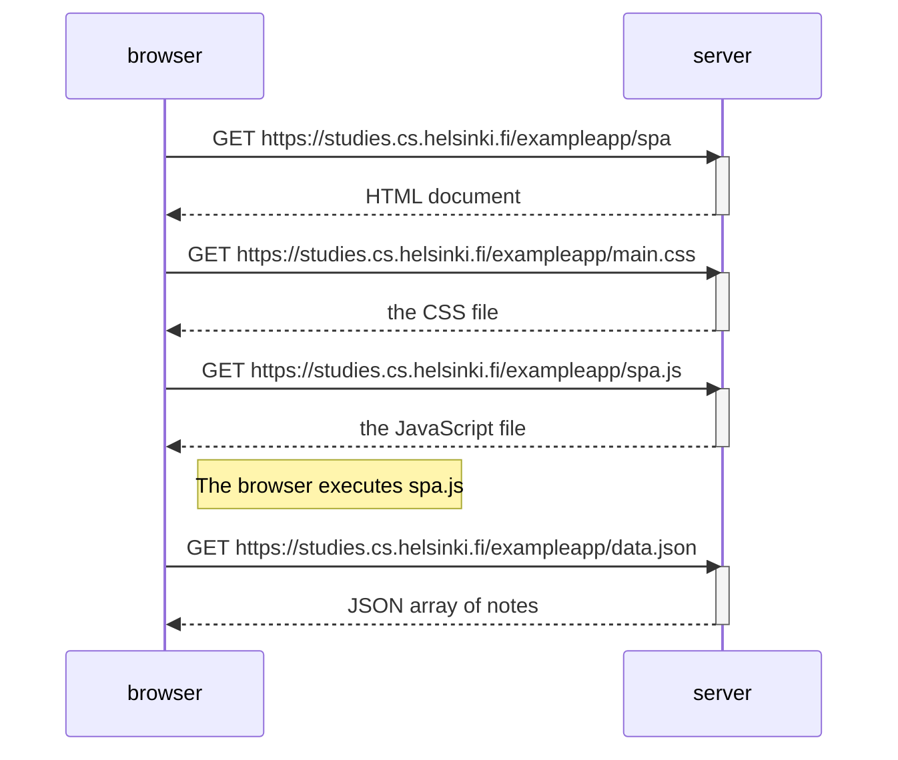

## Part 0 Diagrams

# 0.4 New Note Diagram


# 0.5 Single Page App Diagram


# 0.6 New Note in Single Page App Diagram

```mermaid
sequenceDiagram
    participant browser
    participant server

    Note right of browser: User writes a note and clicks Save

    browser-->>browser: JS intercepts form submission (e.preventDefault())
    browser-->>browser: Add new note to local notes[] array
    browser-->>browser: Call redrawNotes() to update the notes list on the page

    browser->>server: POST https://studies.cs.helsinki.fi/exampleapp/new_note_spa with JSON { content, date }
    activate server
    server-->>browser: HTTP 201 Created (confirmation)
    deactivate server

    Note right of browser: Page does not reload, new note is already displayed
